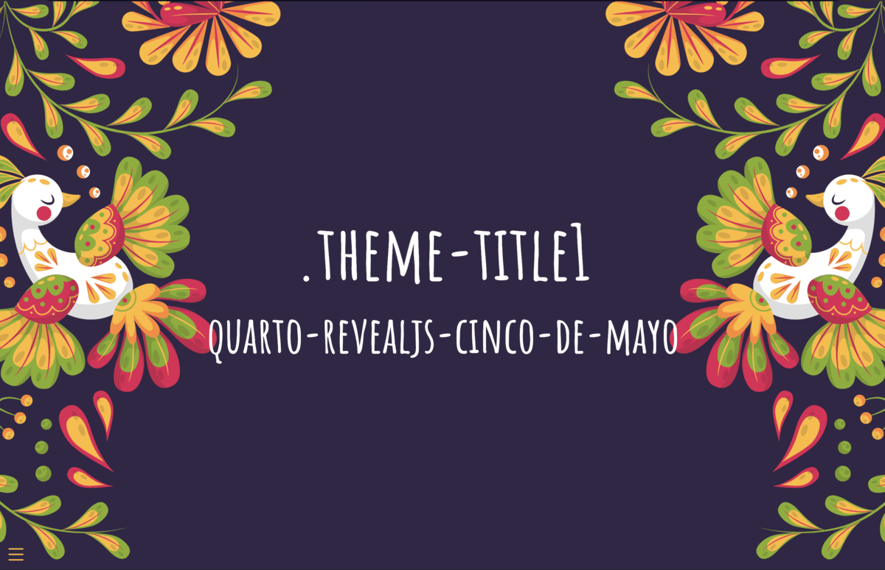

# Quarto Revealjs Cinco De Mayo theme



A [Quarto](https://quarto.org) extension for authoring Cinco De Mayo themed Reveal.js presentations.

## Installation

To start a new presentation:

``` bash
quarto use template EmilHvitfeldt/quarto-revealjs-cinco-de-mayo
```

## Build the presentation

``` bash
quarto render mydocument.qmd
```

## Going further

Read the [Quarto documentation on reveal.js format](https://quarto.org/docs/presentations/revealjs/)
